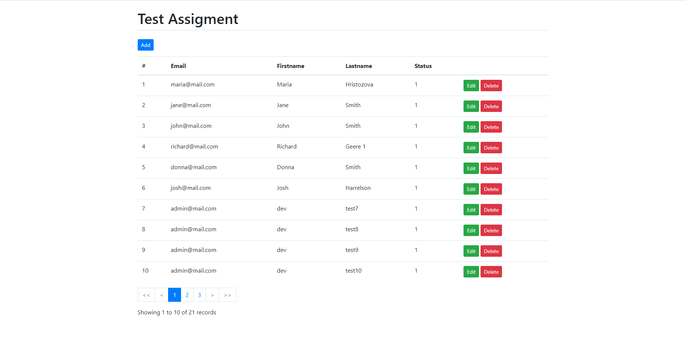

# Mailer-App

Mailer Test app.

This is a simple PHP Project with [Vue.js](https://v2.vuejs.org) handling Front-end Form and serve as API endpoint




## Getting Started

First, install dependencies:

```bash
composer install
```

Copy and rename .env.example to .env and then update database connections settings.
Create new database name as you like and import the data inside seed.sql.

Open [http://localhost:3000](http://localhost:3000) with your browser to see the result.

[API routes] can be accessed on [http://localhost:3000/api](http://localhost:3000/api). This endpoint can be edited in `api.php`.

`Vue.js` script is inside `app.js` and will be loaded by index.html

Memcached is required to be run on WebServer. Please make sure you already have this PHP extention also enabled.
[Memcached setup](https://stackoverflow.com/questions/74913801/how-to-get-memcache-to-work-on-php-with-windows)

Run test on root folder
```bash
 ./vendor/bin/phpunit tests ApiTest.php
```

